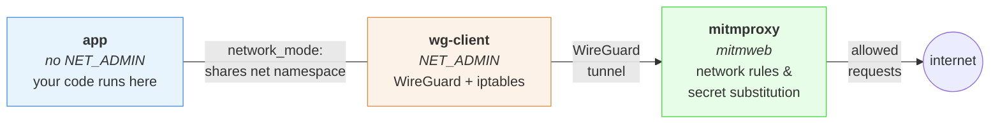
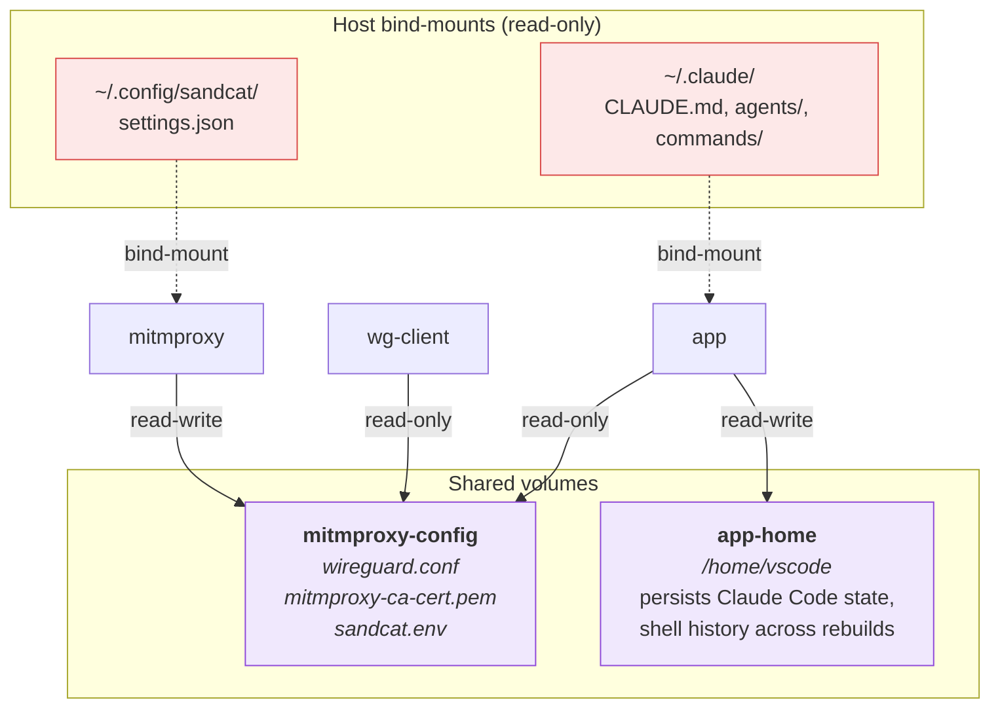
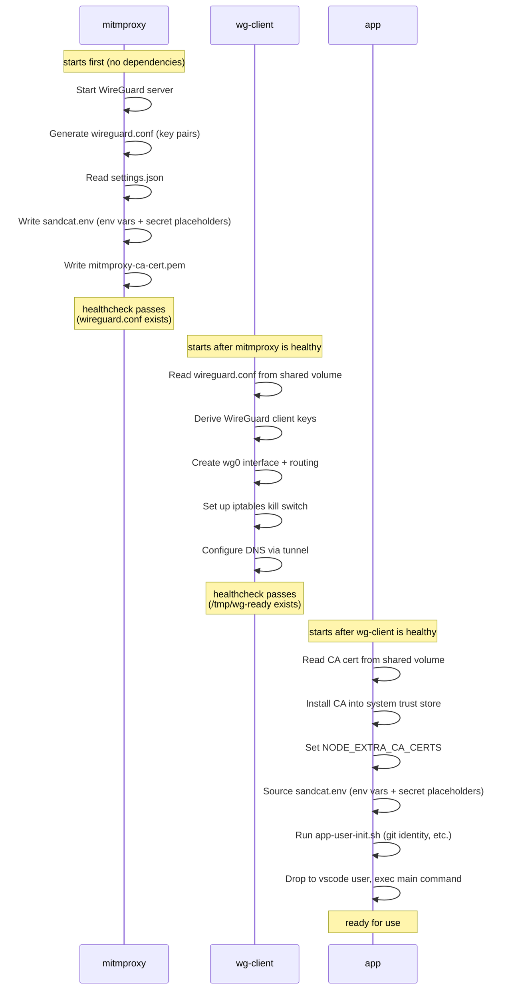

# Sandcat

Sandcat is a [dev container](https://containers.dev) setup for running AI agents
(or any code) in a sandboxed environment with controlled network access and
transparent secret substitution — while retaining the convenience of working in
an IDE like VS Code.

All container traffic is routed through a transparent
[mitmproxy](https://mitmproxy.org/) via WireGuard, capturing HTTP/S, DNS, and
all other TCP/UDP traffic without per-tool proxy configuration. A network policy
engine controls which requests are allowed, and a secret substitution system
injects credentials at the proxy level so the container never sees real values.

## Quick start: try it out

Create a settings file with your secrets and network rules:

```sh
mkdir -p ~/.config/sandcat
cp settings.example.json ~/.config/sandcat/settings.json
# Edit with your real values
```

Then start the container to verify everything works:

```sh
docker compose -f .devcontainer/compose.yml run --rm --build app bash
```

Inside the container:

```sh
# Should return 200 (mitmproxy CA is trusted)
curl -s -o /dev/null -w '%{http_code}\n' https://example.com

# Check secret substitution (if you configured a GitHub token)
gh auth status
```

See [Testing the proxy](#testing-the-proxy) for more verification steps.

## Quick start: add to your project

Add sandcat as a git submodule inside `.devcontainer/`:

```sh
git submodule add https://github.com/softwaremill/sandcat.git .devcontainer/sandcat
```

Your `.devcontainer/` directory should end up looking like this:

```
.devcontainer/
├── sandcat/              # the submodule
│   ├── compose.yml       # mitmproxy + wg-client services
│   ├── scripts/
│   │   ├── app-init.sh            # entrypoint for app containers (root)
│   │   ├── app-user-init.sh      # vscode-user tasks (git identity, CLI update)
│   │   ├── mitmproxy_addon.py    # mitmproxy addon (network rules + secret substitution)
│   │   └── wg-client-init.sh     # wg-client entrypoint
│   └── settings.example.json
├── compose.yml           # your project's compose file (includes sandcat)
├── Dockerfile            # your app container image
└── devcontainer.json     # dev container configuration
```

In your `.devcontainer/compose.yml`, include sandcat's compose file and
add your app service:

```yaml
include:
  - path: sandcat/compose.yml

services:
  app:
    build:
      context: .
      dockerfile: Dockerfile
    network_mode: "service:wg-client"
    volumes:
      - ..:/workspaces/project:cached
      # Named volume so user-level config persists across rebuilds.
      - app-home:/home/vscode
      # CA cert, env vars, and secret placeholders.
      - mitmproxy-config:/mitmproxy-config:ro
      # Host Claude Code customizations (remove if files don't exist).
      - ~/.claude/CLAUDE.md:/home/vscode/.claude/CLAUDE.md:ro
      - ~/.claude/agents:/home/vscode/.claude/agents:ro
      - ~/.claude/commands:/home/vscode/.claude/commands:ro
    command: sleep infinity
    depends_on:
      wg-client:
        condition: service_healthy

volumes:
  app-home:
```

The key parts: `network_mode: "service:wg-client"` routes all traffic
through the WireGuard tunnel, and the `mitmproxy-config` volume gives
your container access to the CA cert, env vars, and secret placeholders.

In your `.devcontainer/Dockerfile`, install whatever dev tooling your
project needs and use `app-init.sh` as the entrypoint:

```dockerfile
FROM mcr.microsoft.com/devcontainers/javascript-node:22

# gosu is used by the entrypoint to drop privileges.
# ca-certificates, curl, git are already in devcontainer base images.
RUN apt-get update \
    && apt-get install -y --no-install-recommends gosu \
    && rm -rf /var/lib/apt/lists/*

COPY --chmod=755 sandcat/scripts/app-init.sh /usr/local/bin/app-init.sh
COPY --chmod=755 sandcat/scripts/app-user-init.sh /usr/local/bin/app-user-init.sh

USER vscode

# Install Claude Code and seed onboarding so it uses the API key
# from secret substitution without interactive setup.
RUN npm install -g @anthropic-ai/claude-code
RUN mkdir -p /home/vscode/.claude \
    && echo '{"hasCompletedOnboarding":true}' > /home/vscode/.claude.json

USER root
ENTRYPOINT ["/usr/local/bin/app-init.sh"]
```

The entrypoint installs the mitmproxy CA certificate into the system
trust store, loads environment variables and secret placeholders from
`sandcat.env`, and drops to the `vscode` user before running the
container's main command.

See [`.devcontainer/Dockerfile`](.devcontainer/Dockerfile) in this
repo for a working example.

### Adapting the Dockerfile for your stack

The bundled Dockerfile uses [mise](https://mise.jdx.dev/) to manage
language toolchains. Add `mise use -g` lines to the marked placeholder
in the Dockerfile to install what you need:

| Stack | mise command |
|-------|-------------|
| TypeScript / Node.js | `mise use -g node@lts` (already installed) |
| Python | `mise use -g python@3.13` |
| Rust | `mise use -g rust@latest` |
| Java | `mise use -g java@21` |

Some runtimes need extra configuration to trust the mitmproxy CA — see
[TLS and CA certificates](#tls-and-ca-certificates).

## Settings format

`~/.config/sandcat/settings.json`:

```json
{
  "env": {
    "GIT_USER_NAME": "Your Name",
    "GIT_USER_EMAIL": "you@example.com"
  },
  "secrets": {
    "ANTHROPIC_API_KEY": {
      "value": "sk-ant-real-key-here",
      "hosts": ["api.anthropic.com"]
    }
  },
  "network": [
    {"action": "allow", "host": "*", "method": "GET"},
    {"action": "allow", "host": "*.github.com", "method": "POST"},
    {"action": "allow", "host": "*.anthropic.com"},
    {"action": "allow", "host": "*.claude.com"}
  ]
}
```

Warning: allowing all GET-traffic, all traffic from GitHub or in fact any
not-fully-trusted/controlled site, leaves the possibility of a prompt injection
attack. Blocking `POST`-traffic might prevent code from being exfiltrated, but
malicious code might still be generated as part of the project.

## Network access rules

The `network` array defines ordered access rules evaluated top-to-bottom.
First matching rule wins (like iptables). If no rule matches, the request
is **denied**.

Each rule has:
- `action` — `"allow"` or `"deny"` (required)
- `host` — glob pattern via fnmatch (required)
- `method` — HTTP method to match; omit to match any method (optional)

### Examples

With the rules above:
- `GET` to any host → **allowed** (rule 1)
- `POST` to `api.github.com` → **allowed** (rule 2)
- `POST` to `api.anthropic.com` → **allowed** (rule 3)
- `POST` to `example.com` → **denied**
- `PUT` to `example.com` → **denied**
- Empty network list → all requests **denied** (default deny)

## Secret substitution

Dev containers never see real secret values. Instead, environment
variables contain deterministic placeholders
(`SANDCAT_PLACEHOLDER_<NAME>`), and the mitmproxy addon replaces them
with real values when requests pass through the proxy.

Inside the container, `echo $ANTHROPIC_API_KEY` prints
`SANDCAT_PLACEHOLDER_ANTHROPIC_API_KEY`. When a request containing that
placeholder reaches mitmproxy, it's replaced with the real key — but only
if the destination host matches the `hosts` allowlist.

### Host patterns

The `hosts` field accepts glob patterns via `fnmatch`:

- `"api.anthropic.com"` — exact match
- `"*.anthropic.com"` — any subdomain
- `"*"` — allow all hosts (use with caution)

### Leak detection

If a placeholder appears in a request to a host **not** in the allowlist,
mitmproxy blocks the request with HTTP 403 and logs a warning. This
prevents accidental secret leakage to unintended services.

### How it works internally

1. The mitmproxy container mounts `~/.config/sandcat/settings.json`
   (read-only) and the `mitmproxy_addon.py` addon script.
2. On startup, the addon reads `settings.json` and writes
   `sandcat.env` to the `mitmproxy-config` shared volume
   (`/home/mitmproxy/.mitmproxy/sandcat.env`). This file contains
   plain env vars (e.g. `export GIT_USER_NAME="Your Name"`) and
   secret placeholders (e.g. `export ANTHROPIC_API_KEY="SANDCAT_PLACEHOLDER_ANTHROPIC_API_KEY"`).
3. App containers mount `mitmproxy-config` read-only at
   `/mitmproxy-config/`. The shared entrypoint (`app-init.sh`)
   sources `sandcat.env` after installing the CA cert, so every
   process gets the env vars and placeholder values.
4. On each request, the addon first checks network access rules. If
   denied, the request is blocked with 403.
5. If allowed, the addon checks for secret placeholders in the request,
   verifies the destination host against the secret's allowlist, and
   either substitutes the real value or blocks the request with 403
   (leak detection).

Real secrets never leave the mitmproxy container.

### Disabling

Delete or rename `~/.config/sandcat/settings.json`. If the file is
absent, the addon disables itself — no network rules are enforced and
`sandcat.env` is not written.

### Claude Code

Claude Code ignores `ANTHROPIC_API_KEY` until onboarding is complete.
Without `{"hasCompletedOnboarding": true}` in `~/.claude.json`, it
prompts for browser-based login instead of using the key. The dev
container Dockerfile sets this during the build, so Claude Code picks
up the API key from secret substitution without manual setup.

**Autonomous mode.** The bundled `devcontainer.json` enables
`claudeCode.allowDangerouslySkipPermissions` and sets
`claudeCode.initialPermissionMode` to `bypassPermissions`. This lets
Claude Code run without interactive permission prompts inside the
container. The trade-off: sandcat already provides the security
boundary (network isolation, secret substitution, iptables kill-switch),
so the in-container prompts add friction without meaningful security
benefit. Remove these settings if you prefer interactive approval.
See [Secure & Dangerous Claude Code + VS Code Setup](https://warski.org/blog/secure-dangerous-claude-code-vs-code-setup/)
for background on this approach.

**Host customizations.** The example `compose.yml` bind-mounts
`~/.claude/CLAUDE.md`, `~/.claude/agents`, and `~/.claude/commands`
from the host (read-only) so your personal instructions, custom agents,
and slash commands are available inside the container. Remove any mount
whose source does not exist on your host — Docker will otherwise create
an empty directory in its place.

## Architecture

### Containers and network



- **mitmproxy** runs `mitmweb --mode wireguard`, creating a WireGuard
  server and storing key pairs in `wireguard.conf`.
- **wg-client** is a dedicated networking container that derives a
  WireGuard client config from those keys, sets up the tunnel with `wg`
  and `ip` commands, and adds iptables kill-switch rules. Only this
  container has `NET_ADMIN`. No user code runs here.
- **App containers** share `wg-client`'s network namespace via
  `network_mode`. They inherit the tunnel and firewall rules but cannot
  modify them (no `NET_ADMIN`). They install the mitmproxy CA cert into
  the system trust store at startup so TLS interception works.
- The mitmproxy web UI is exposed on a dynamic host port (see below)
  to avoid conflicts when multiple projects include sandcat. Password:
  `mitmproxy`.

### Volumes

The containers communicate through two shared volumes and several
bind-mounts from the host:



- **`mitmproxy-config`** is the key shared volume. Mitmproxy writes to
  it (WireGuard keys, CA cert, `sandcat.env` with env vars and secret
  placeholders); all other containers mount it read-only.
- **`app-home`** persists the vscode user's home directory across
  container rebuilds (Claude Code auth, shell history, git config).
- **`settings.json`** is bind-mounted from the host into mitmproxy
  only — app containers never see real secrets.
- **Claude Code customizations** (`CLAUDE.md`, `agents/`, `commands/`)
  are bind-mounted from the host into the app container read-only.

### Startup sequence

The containers start in dependency order. Each step writes data to the
shared `mitmproxy-config` volume that the next step reads:



## Hardening the VS Code setup

Sandcat secures the **network path** out of the container, but VS Code's
dev container integration introduces a separate trust boundary. The VS
Code remote architecture gives container-side extensions access to host
resources (terminals, credentials, clipboard) through the IDE channel,
bypassing network-level controls entirely.

For background on these attack vectors see
[Leveraging VS Code Internals to Escape Containers](https://blog.theredguild.org/leveraging-vscode-internals-to-escape-containers/).

### What the bundled devcontainer.json already does

The included `devcontainer.json` applies the following mitigations out of
the box:

- **Clears forwarded credential sockets** (`SSH_AUTH_SOCK`,
  `GPG_AGENT_INFO`, `GIT_ASKPASS`) via `remoteEnv` so container code
  cannot piggyback on host SSH keys, GPG signing, or VS Code's git
  credential helpers. Clearing env vars alone only hides the path —
  the socket file in `/tmp` can still be discovered by scanning.
- **Removes the SSH agent socket** via a `postStartCommand` script
  that deletes `vscode-ssh-auth-*.sock` from `/tmp` after VS Code
  connects. This is a best-effort measure — the socket path pattern
  could change in future VS Code versions.
- **Disables git config copying** (`dev.containers.copyGitConfig:
  false`) to prevent leaking host credential helpers and signing key
  references into the container.
- **Enables workspace trust** (`security.workspace.trust.enabled: true`)
  so VS Code prompts before applying workspace settings that container
  code could have modified via the bind-mounted project folder.
- **Blocks local terminal creation**
  (`terminal.integrated.allowLocalTerminal: false`) so container
  extensions cannot call `workbench.action.terminal.newLocal` to open a
  shell on the host, which would bypass the WireGuard tunnel entirely.
  For maximum protection, also set this in your **host** user settings
  (workspace settings could theoretically override it).

### Consequences of hardening

Disabling credential forwarding and git config copying improves
isolation but requires a few adjustments.

**Git identity.** With `dev.containers.copyGitConfig` set to `false`,
git inside the container has no `user.name` or `user.email`. Add them
to the `env` section of your `settings.json`:

```json
"env": {
    "GIT_USER_NAME": "Your Name",
    "GIT_USER_EMAIL": "you@example.com"
}
```

The mitmproxy addon writes `env` entries to the shared env file
(alongside secret placeholders), and `app-user-init.sh` applies
`GIT_USER_NAME`/`GIT_USER_EMAIL` via `git config --global` at container
startup.

**HTTPS remotes only.** With `SSH_AUTH_SOCK` cleared, SSH-based git
remotes will not work. Use HTTPS URLs instead — sandcat's secret
substitution handles GitHub token authentication over HTTPS
transparently. Convert existing remotes with:

```sh
git remote set-url origin https://github.com/owner/repo.git
```

## Testing the proxy

Once inside the container (see [Quick start: try it out](#quick-start-try-it-out)),
you can inspect traffic in the mitmproxy web UI. The host
port is assigned dynamically — look it up from a host terminal with:

```sh
docker compose -f .devcontainer/compose.yml port mitmproxy 8081
```

Or using Docker's UI. Log in with password `mitmproxy`.

To verify the kill switch blocks direct traffic:

```sh
# Should fail — iptables blocks direct eth0 access
curl --max-time 3 --interface eth0 http://1.1.1.1

# Should fail — no NET_ADMIN to modify firewall
iptables -F OUTPUT
```

To verify secret substitution for the github token:

```sh
gh auth status
```

## Unit tests

```sh
cd scripts && pytest test_mitmproxy_addon.py -v
```

## Inspiration

Sandcat is mainly inspired by
[Matchlock](https://github.com/jingkaihe/matchlock), which provides similar
network isolation and secret substitution, however in the form of a dedicated
command line tool. While Matchlock VMs offer greater isolation and security,
they also lack the convenience of a dev containers setup, and integration with
an IDE.

[agent-sandbox](https://github.com/mattolson/agent-sandbox) implements a proxy
that runs alongside the container, however without secret substitution.
Moreover, the proxy is not transparent, instead relying on the more traditional
method of setting the `PROXY` environment variable.

Finally, Sandcat builds on the Docker+mitmxproxy in WireGuard mode integration
implemented in
[mitm_wg](https://github.com/Srikanth0824/side-projects/tree/main/mitm_wg).

## Notes

### Why not wg-quick?

`wg-quick` calls `sysctl -w net.ipv4.conf.all.src_valid_mark=1`, which
fails in Docker because `/proc/sys` is read-only. The equivalent sysctl
is set via the `sysctls` option in `compose.yml`, and the entrypoint
script handles interface, routing, and firewall setup manually.

### TLS and CA certificates

Sandcat's mitmproxy intercepts TLS traffic, so the app container must
trust the mitmproxy CA. `app-init.sh` installs it into the system
trust store, which is enough for most tools — but some runtimes bring
their own CA handling:

- **Node.js** bundles its own CA certificates and ignores the system
  store. `app-init.sh` sets `NODE_EXTRA_CA_CERTS` automatically. If
  you write a custom entrypoint, make sure to include this or Node-based
  tools will fail TLS verification.
- **Rust** programs using `rustls` with the `webpki-roots` crate bundle
  CA certificates at compile time and will not trust the mitmproxy CA.
  Use `rustls-tls-native-roots` in reqwest so it reads the system CA
  store at runtime instead.
- **Java** uses its own trust store (`cacerts`). Import the mitmproxy CA
  at runtime by adding this to `app-init.sh` or a wrapper script
  before the `exec` line:
  ```sh
  keytool -importcert -trustcacerts -noprompt \
    -alias mitmproxy -file /mitmproxy-config/mitmproxy-ca-cert.pem \
    -keystore "$JAVA_HOME/lib/security/cacerts" -storepass changeit
  ```
- **Python** uses the system CA store — works out of the box.

## Development

Start the container from the command line:

```sh
docker compose -f .devcontainer/compose.yml run --rm --build app bash
```

Tear down all containers and volumes (resets persisted home directory):

```sh
docker compose -f .devcontainer/compose.yml down -v
```

## Commercial Support

We offer commercial services around AI-assisted software development.
[Contact us](https://virtuslab.com) to learn more about our offer!

## Copyright

Copyright (C) 2026 VirtusLab [https://virtuslab.com](https://virtuslab.com).